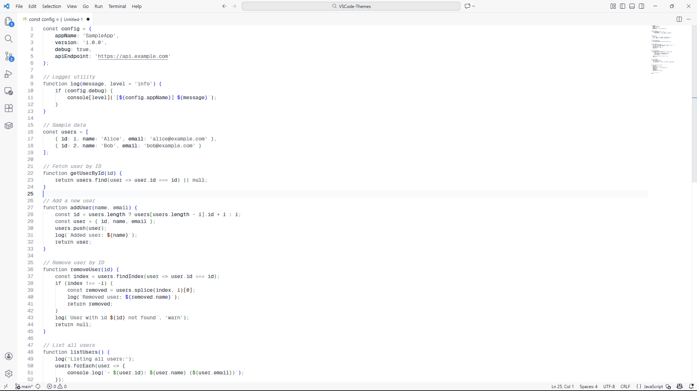
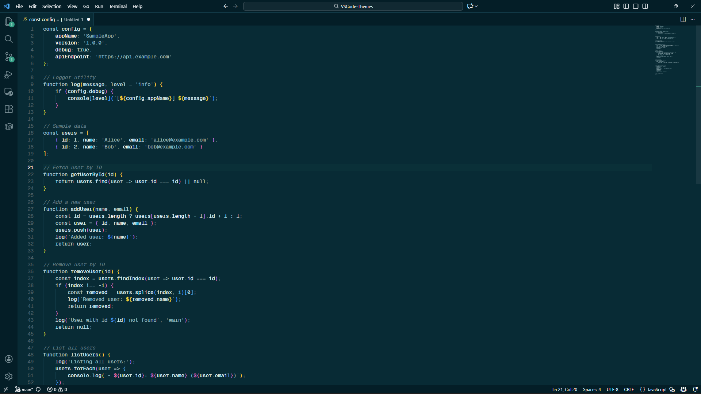

# Logseq Tone

A VS Code color theme inspired by [Logseq](https://logseq.com/)'s calm, focused design with subtle, Base4Tone-inspired monochromatic syntax highlighting. Perfect for distraction-free coding and note-taking.

[](https://marketplace.visualstudio.com/items?itemName=your-publisher.logseq-tone-theme)
[](https://marketplace.visualstudio.com/items?itemName=your-publisher.logseq-tone-theme)
[](LICENSE)

## ✨ Features

- 🎨 **Two Beautiful Variants**: Light and dark themes inspired by Logseq's authentic colors
- 👁️ **Easy on the Eyes**: Base4Tone-style syntax with subtle, low-contrast highlighting
- 🧘 **Distraction-Free**: Monochromatic syntax keeps focus on your code structure
- 📝 **Markdown Optimized**: Perfect for note-taking and documentation
- 🎯 **True to Logseq**: Colors pulled directly from Logseq's codebase

## 📸 Screenshots

### Light Theme


### Dark Theme  


## 🚀 Installation

### From VS Code Marketplace (Recommended)

1. Open **Extensions** sidebar in VS Code (`Ctrl+Shift+X` / `Cmd+Shift+X`)
2. Search for **"Logseq Tone"**
3. Click **Install**
4. Select theme: `Preferences > Color Theme` → **Logseq Tone Light** or **Logseq Tone Dark**

### From VSIX File

1. Download the `.vsix` file from [Releases](https://github.com/yourusername/logseq-tone-theme/releases)
2. Open VS Code
3. Go to Extensions view (`Ctrl+Shift+X` / `Cmd+Shift+X`)
4. Click the `...` menu → **Install from VSIX...**
5. Select the downloaded file

## 🎨 Color Palette

### Light Theme
| Element | Color | Usage |
|---------|-------|-------|
| Background | `#FFFFFF` | Clean white, matching Logseq's default |
| Foreground | `#1F2937` | Dark gray for text |
| Accent | `#1781E3` | Logseq's signature blue for links |
| Syntax | `#9CA3AF` → `#1F2937` | Subtle gray monochrome scale |
| Sidebar | `#F7F7F7` | Light gray background |

### Dark Theme  
| Element | Color | Usage |
|---------|-------|-------|
| Background | `#002B36` | Logseq's classic dark teal |
| Foreground | `#F5F7FA` | Light gray text |
| Accent | `#16A085` | Logseq's teal signature color |
| Syntax | `#5E7A82` → `#E8F4F7` | Harmonious teal/cyan gradient |
| Sidebar | `#001E28` | Darker teal background |

## 🤔 Why Logseq Tone?

This theme is designed for developers and writers who:
- ✅ Use or love Logseq's aesthetic
- ✅ Want subtle syntax highlighting that doesn't distract
- ✅ Prefer monochromatic, low-contrast themes
- ✅ Work with Markdown and documentation frequently
- ✅ Value eye comfort during long coding sessions

## ⚙️ Recommended Settings

For the best experience, consider these VS Code settings:

```json
{
  "editor.fontFamily": "JetBrains Mono, Fira Code, Consolas, monospace",
  "editor.fontSize": 14,
  "editor.lineHeight": 1.6,
  "editor.fontLigatures": true,
  "editor.cursorBlinking": "phase",
  "editor.cursorSmoothCaretAnimation": "on",
  "workbench.iconTheme": "material-icon-theme"
}
```

## 🛠️ Development

Want to contribute or customize? See [CONTRIBUTING.md](CONTRIBUTING.md) for details.

Quick start:
```bash
git clone https://github.com/yourusername/logseq-tone-theme.git
cd logseq-tone-theme
# Press F5 in VS Code to test the theme
```

## 🤝 Contributing

Contributions are welcome! Please read [CONTRIBUTING.md](CONTRIBUTING.md) for details on our code of conduct and the process for submitting pull requests.

## 📝 Changelog

See [CHANGELOG.md](CHANGELOG.md) for a list of changes.

## 📄 License

This project is licensed under the MIT License - see the [LICENSE](LICENSE) file for details.

## 🙏 Acknowledgments

- Inspired by [Logseq](https://logseq.com/)'s beautiful, distraction-free design
- Syntax highlighting philosophy influenced by [Base4Tone](https://github.com/atelierbram/Base4Tone-vscode)
- Colors extracted from Logseq's official codebase

## 💬 Feedback

Found a bug or have a suggestion? Please [open an issue](https://github.com/yourusername/logseq-tone-theme/issues) on GitHub.

## ⭐ Support

If you enjoy this theme, please consider:
- ⭐ Starring the [GitHub repository](https://github.com/yourusername/logseq-tone-theme)
- 📝 Leaving a review on the [VS Code Marketplace](https://marketplace.visualstudio.com/items?itemName=your-publisher.logseq-tone-theme)
- 🐦 Sharing it with others

---

**Enjoy coding with Logseq Tone!** 🎨✨
